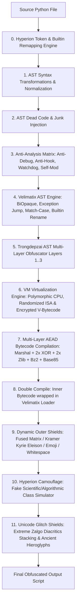

# AGENTS.md - Developer & Agent Operational Handbook

Welcome to the **Tr0ngX Ultimate AST Obfuscator** codebase repository. This document serves as the authoritative operational manual and architecture guide for all AI Agents (Antigravity, Codex, Crush, Claude, etc.) and human contributors collaborating on this project.

---

## 1. Core Directives & Mandatory Rules for Agents

All AI agents operating on this repository MUST strictly abide by the following protocol:

1. **Documentation Synchronization (Strict Mandate)**:
   - Every time a new feature, new transformation pass, or new `--` command-line argument is added or modified in `tr0ngx_obfuscator.py`, the agent **MUST immediately update** both `README.md` and `AGENTS.md` with:
     - The exact CLI argument syntax and choices.
     - A concise explanation of what the feature does and its position in the pipeline.
     - Updated CLI option tables and summary metrics.
2. **Emoji Policy in Documentation**:
   - Per repository design standards, markdown documentation (`README.md`, `AGENTS.md`, docs) MUST remain clean of emojis, with the sole exception of the footer:
     `Made with ❤️ by Tr0ngX & Anti-Reverse Engineering Research Community`
3. **Deterministic Compatibility & Zero-Crash Standard**:
   - Every obfuscation mode, loader, and cryptographic wrapper MUST execute flawlessly on **Python 3.10, 3.11, 3.12, 3.13, and 3.14** without syntax errors or runtime regressions.
   - Self-testing and assertion verification must pass with 100% success before handing over work.
4. **Git Discipline**:
   - Remove scratch or temporary test output files (e.g. `test_*.py` generated during testing) before committing.
   - Commit changes with clear, descriptive messages and push directly to `origin main`.
5. **Testing Concurrency Rule (Strict Prohibition)**:
   - **NEVER execute multi-threaded test harnesses** (e.g. `python tests/run_all_tests.py -w ...` or parallel worker jobs) WITHOUT EXPLICIT PERMISSION/COMMAND FROM THE USER.
   - All default test runs, validation, and self-testing MUST run in single-thread / single-process mode (`-w 1` or individual standalone target scripts) to avoid system overload and resource starvation.

---

## 2. System Architecture Overview

Tr0ngX is an industrial-grade, multi-stage Python AST Obfuscator combining advanced compiler theory, control flow flattening, cryptographic authenticated loaders, dynamic outer shields, and decompiler crash mechanics.

### Pipeline Execution Order



---

## 3. Comprehensive CLI Flag Reference

| Flag | Category | Description | Choices / Format |
| :--- | :--- | :--- | :--- |
| `-i`, `--input` | IO | Target Python script(s) or glob patterns to obfuscate | `<filepath(s) / glob>` |
| `-D`, `--dir`, `--directory` | IO | Target directory containing Python files to batch obfuscate | `<dirpath>` |
| `-r`, `--recursive` | IO | Recursively scan all subdirectories when batch obfuscating | Flag |
| `-w`, `--workers`, `-j` | Resource | Number of parallel worker threads for concurrent batch obfuscation | e.g. `4`, `8` |
| `-o`, `--output` | IO | Custom output file destination (or output directory for batch) | `<filepath / dirpath>` |
| `-m`, `--mode` | Core AST | AST obfuscation complexity level | `1`, `2`, `3` |
| `--moreobf` | Core AST | Inject extra AST dead code and try-except decoy blocks | `y` / `n` |
| `--antidebug` | Protection | Inject anti-debugging watchdog daemon, Win32 PEB/remote debug checks, and hook blockers | `y` / `n` |
| `--antivm` | Protection | Inject Anti-VM, Automated Sandbox & Virtual Network Adapter Detection matrix (MAC OUI, virtual NICs, SCSI disks, drivers, registry) | `y` / `n` |
| `--anti-dump` | Protection | Inject in-memory anti-dump shield, GC object scrubber, and code metadata neutralizer | `y` / `n` |
| `--selfmod` | Protection | Inject runtime signature mutating self-modification layer | `y` / `n` |
| `--math-opaque` | Core AST | Inject number-theoretic mathematical opaque predicates (Quadratic Non-Residues mod 7, Euler invariants) | `y` / `n` |
| `--dyn-strings` | Core AST | Dynamic per-callsite string XOR encryption with AST-coordinate derived keys | `y` / `n` |
| `--dec-trap`, `--dectrap` | Core AST | Inject decompiler control flow traps & opaque CFG blocks (crashes uncompyle6, decompyle3, pycdc) | `y` / `n` |
| `--var-split` | Core AST | Split local integer variables into dynamic XOR secret shares (v1 ^ v2) | `y` / `n` |
| `--str-frag` | Core AST | String fragmentation v2 with decoy chunks and dynamic runtime assembly | `y` / `n` |
| `--debug-poison` | Protection | Deceptive debug poison state machine (silent key degradation on debugger/sandbox detection) | `y` / `n` |
| `--spoof-meta` | Protection | Metadata & `co_filename` spoofing (camouflages stack traces to stdlib modules) | `y` / `n` |
| `--compile` | Crypto | Multi-layer authenticated AEAD compilation (Marshal + XOR + Zlib + Bz2) | `y` / `n` |
| `--password` | Crypto | Password for Argon2id + ChaCha20-Poly1305 AEAD / PBKDF2 (600k) payload encryption. Password mode REQUIRES the `cryptography` package and hard-fails otherwise (no silent downgrade) | `<string>` |
| `--password-file` | Crypto | Path to external file containing encryption password (missing/empty file aborts with exit 2) | `<filepath>` |
| `--exotic-pools` | Identifiers | Identifiers drawn from rare Unicode script pools (Tangut, Egyptian Hieroglyphs+Ext-A, CJK Ext-G/H, Anatolian, Bamum, Glagolitic, Miao, Vedic); XID + NFKC validated via `tr0ngx_exotic.py` | `y` / `n` |
| `--base4096` | Exotic Encoding | Pack payload into 12-bit groups mapped to a 4096-glyph exotic alphabet with standalone inline decoder | `y` / `n` |
| `--bit-matrix` | Exotic Encoding | Multi-round invertible byte chain: LCG-XOR stream, bit rotation, nibble swap, Fisher-Yates S-Box, position mask | `y` / `n` |
| `--lzma-layer` | Crypto | LZMA (preset 9) pre-encryption compression stage inside `_multi_layer_encrypt`; decode chain mirrors per-build armor metadata | `y` / `n` |
| `--env-key` | Crypto | Hardware fingerprint lock for no-password builds: transmitted salt XOR-blinded with sha256(node/system/machine/impl/ver); wrong machine fails authentication. Mutually exclusive with password modes (auto-disabled with warning) | `y` / `n` |
| `--verify` | Diagnostics | Post-build semantic differential: runs original + obfuscated outputs, compares stdout and exit codes; mismatch logged as `13_verify_semantic` stage error | `y` / `n` |
| `--shared-symbols` | Batch | Two-phase cross-module symbol sync for `-D/-r` batches: phase A parses all targets single-threaded and freezes one deterministic rename (`sha256(seed\|name)` derived) per symbol imported across files into `tr0ngx_shared_symbols.json`; phase B workers consume the immutable map via Hyperion token renamer | `y` / `n` |
| `--max-output-size` | Resource | Maximum output file size DoS limit (aborts and removes if exceeded) | e.g. `10MB`, `50MB` |
| `--seed` | Core AST | Deterministic seed for reproducible builds | e.g. `1337` |
| `--velimatix` | Velimatix | Enable Velimatix ExceptionJump & AST control flow engine | `y` / `n` |
| `--veli-level` | Velimatix | Velimatix intensity level (1: BiOpaque, 2: Exception Jump, 3: Match-Case State Machine) | `1`, `2`, `3` |
| `--vm-obf` | Core VM | Enable VM Virtualization Engine (Polymorphic Virtual CPU + Encrypted Bytecode) | `y` / `n` |
| `--vm-level` | Core VM | VM Virtualization intensity level (1: Basic, 2: + Traps/NOP, 3: + Dummy/Scrub) | `1`, `2`, `3` |
| `--double-compile` | Crypto | Package inner compiled bytecode inside outer Velimatix loader | `y` / `n` |
| `--kramer` | Outer Shield | Wrap with Kramer Kyrie Eleison outer dynamic shield class | `y` / `n` |
| `--matrix`, `--fused` | Outer Shield | Enable 3-Track Symbiotic Interleaved Matrix Shield (Kyrie + Emoji + Whitespace) | `y` / `n` |
| `--emoji-obf` | Outer Shield | Encode output payload as executable Unicode Animal block identifier stream | `y` / `n` |
| `--whitespace-obf` | Outer Shield | Encode output as invisible whitespace bitfields (space/tab binary) | `y` / `n` |
| `--blank-padding`, `--blank-lines` | Outer Shield | Prepend 300+ blank screen lines padding to conceal code in text editors | `y` / `n` |
| `--cjk-vars` | Identifiers | Use CJK Chinese identifiers and PyCool ancient docstrings | `y` / `n` |
| `--homoglyph` | Identifiers | Use Cyrillic/Greek lookalike variable names (a→а, o→о, e→е) | `y` / `n` |
| `--rare-unicode` | Identifiers | Use Rare Unicode characters (CJK Ext-B, Kangxi Radicals, Hieroglyphs) | `y` / `n` |
| `--zalgo`, `-z` | Glitch Shield | Enable Extreme Zalgo Combining Marks Shield (Heavy Diacritics Stacking - `Z͑͗͑͗...`) | `y` / `n` |
| `--hyperion` | Hyperion | Enable Full Hyperion Engine (Builtins remapping, token variable remap, math/str splitting, chunk shells) | `y` / `n` |
| `--camouflage`, `--camo` | Camouflage | Wrap in Hyperion Fake Scientific Simulation Class (`MemoryAccess`, `StackOverflow`, `Theory`, etc.) | `y` / `n` |
| `--force-py` | Environment | Multi-vector anti-spoof Python runtime & opcode architecture lock (`off` to disable) | `3.10`, `3.11`, `3.12`, `3.14`, etc. |
| `--max-ram` | Resource | Limit maximum RAM consumption in megabytes | e.g. `2048` |
| `--cores` | Resource | Limit maximum CPU cores/threads utilized | e.g. `2`, `4` |
| `--debug-map` | Diagnostics | Export JSON mapping of renamed symbols and stage durations | `AUTO` or `<path>` |
| `--debug`, `-d` | Diagnostics | Verbose stage logging and tracebacks | Flag |
| `--profile` | Diagnostics | Display detailed Profiling Waterfall & Bottleneck table | Flag |
| `--log-file` | Diagnostics | Write diagnostic execution logs to external file | `<path>` |
| `--strict` | Diagnostics | Abort immediately on any stage warning or non-critical error | Flag |
| `--no-art`, `-q` | UI | Suppress ASCII art banners and styling for headless CLI/Agent environments | Flag |

---

## 4. Key Subsystem Details

### 4.1 Hyperion Engine (`--hyperion`)
- **AddBuiltins**: Scans token AST, extracts all builtins referenced in code, and prepends explicit imports (`from builtins import ...`) to enable dynamic namespace redirection.
- **CreateVars & Scope Remapper**: Generates randomized variables for runtime primitives (`globals`, `locals`, `vars`, `__import__`, `getattr`, `dir`, `exec`, `eval`, `compile`, `unhexlify`, `join`, `bool`, `str`, `float`).
- **Math & String Identifier Splitting**: Transforms numeric constants into arithmetic algebraic identities (`val = rnum - (rnum - val)` with underscore notation `1_2_3_4`) and encodes strings through arithmetic reverse step slicing (`[::-+-(-1)]`).
- **Chunk Shell Encapsulation**: Partitions top-level statements into isolated valid AST chunks, each encapsulated inside `eval(compile(..., mode='exec'))`.

### 4.2 Hyperion Camouflage Layer (`--camouflage`)
- Replaces the outer file structure with an authentic-looking algorithmic or scientific computing class (`MemoryAccess`, `StackOverflow`, `Theory`, `Calculate`, `Hypothesis`).
- Creates mock mathematical methods, `@property` simulated memory addresses (`<__main__.MemoryAccess object at 0x000007FF...>`), and fake `try...except` exception handlers.
- Slices the obfuscated binary payload into Base85 parameter chunks stored as class properties and seamlessly reconstructs the payload at runtime.

### 4.3 Extreme Zalgo Combining Marks Shield (`--zalgo`, `-z`)
- Employs valid Python PEP 3131 Unicode identifiers utilizing `XID_Continue` characters (`Mn`/`Mc` diacritics in `U+0300..U+036F`, `U+1AB0..U+1AFF`, `U+1DC0..U+1DFF`, `U+20D0..U+20FF`, `U+FE20..U+FE2F`).
- Stacks 25 to 60 combining diacritical marks onto each variable character (`Z͑͗͑͗...`), overwhelming the text rendering engines of GUI editors, decompiler GUIs, and disassemblers (DirectWrite, HarfBuzz, FreeType, Scintilla).
- Injects massive cascading glitch text docstrings at the payload boundaries.

### 4.4 Fused Symbiotic Matrix Shield (`--matrix`, `--fused`)
- Interweaves three distinct disguise tracks into a single unified stream:
  1. Kyrie Eleison Alphabet Rotation + Dynamic Caesar Offset.
  2. Masked Unicode Emoji Stream (`U+1F400` Animal & Symbol block).
  3. Invisible Space/Tab Bitfield Matrix.
- Uses a deterministic Linear Congruential Generator (LCG) PRNG state to interleave and reconstruct tracks in memory with zero file-size bloat.

### 4.5 Polymorphic VM Virtualization Engine (`--vm-obf`, `--vm-level`)
- **Virtual CPU & Polymorphic ISA**: Compiles AST statement chunks into encrypted bytecode blocks (`marshal` + rolling XOR + Base85), executed by a lightweight runtime virtual interpreter.
- **Randomized Opcode Matrix**: Opcode byte assignments (`V_EXEC`, `V_HALT`, `V_NOP`, `V_TRAP`, `V_SCRUB`) are generated fresh per build across a 256-value space.
- **Visual Camouflage Integration**: VM registers, program counters, data pools, and dispatchers utilize the repository's hostile identifier matrix (Zalgo, CJK, Homoglyph, Rare Unicode, Invisible).
- **Anti-Analysis Trap Network**: Level 2+ injects rolling NOP sequences (p=0.15) and unreachable dead traps (1-3x, random 16-bit args) after RETURN/HALT/RAISE. Level 3 adds dummy LOAD_CONST/POP_TOP cycles (p=0.10) plus post-frame scrub (`stack/exc_handlers.clear()`). NOTE: "decoy encrypted chunks" and "GC zeroing" are NOT implemented - scrub is dict/list `.clear()` only; docs corrected 2026-08 after audit.
- **Full Language Coverage (TVM 3.0)**: real resumable generators (lazy iteration, send/throw/close, multi-level yield-from with return capture), full async surface (await hand-off on the running loop, async-for via a sentinel-free `__vm_anext__` tuple protocol, async-with, async generators, async comprehensions desugared into inline awaited helpers), positional defaults evaluated once at function creation (native semantics), correct `import a.b as c` submodule binding, `raise X from Y` cause propagation, dict-literal insertion-order preservation, and interpreter-internal builtin isolation (`_sys_len`) so user shadowing of builtins cannot corrupt the VM.
- **Level 4 Infrastructure**: deterministic per-name 256-byte ISA permutation implemented end-to-end (serializer substitution + runtime inverse dispatch), currently gated OFF pending unique per-code-object salts; at present `--vm-level 4` executes identically to level 3.

### 4.7 TVM Correctness Wave (2026-08, VM upgrade plan Phase 0/1 partial)
Fixes landed (all verified by test_vm_oracle_semantic 31/31 + test_vm_full_coverage 156/156):
- `visit_AsyncFunctionDef` never finalized/stored its code object -> UnboundLocalError on EVERY async def under `--vm-obf`. Now mirrors visit_FunctionDef (kwonly-default preamble included).
- Positional-only params (`/`) concatenated into signatures everywhere (FunctionDef/AsyncFunctionDef/Lambda); binding order fixed. NOTE: `/` keyword-rejection is NOT yet enforced at runtime.
- `emit()` raises typed `TVMEmitError` on args outside 16-bit range (was silent truncation corrupting jumps).
- `_vm_obfuscate` parse failure no longer silently returns plaintext: records `6.5_vm_parse_failed` stage error (respected by `--strict`) + loud warning.
- Known deferred (documented honestly): TVM crypto-envelope v4 (password-derived packet keys, tag cascade, TVM1 header, meta-packet ISA hiding) was prototyped but rolled back pending a clean re-land; current envelope remains v3 embedded-seed = tamper-resistance only. Arity/missing-arg native TypeErrors, closure cell boxing, except* lowering, fromlist imports: tracked for next wave.

### 4.6 Research Hardening Wave (2026-08, sourced from research_repos analysis)
Attribution policy: techniques are re-implemented independently; source repos credited inline as `Source:` comments. No GPL/AGPL/no-license code was copied (see license matrix in the research report): MIT/Apache sources are concept-level only unless noted.

Fixes applied (audit P0/P1):
- Anti-debug Vector 15 audit-canary self-defeat: real `sys.addaudithook` is snapshotted before nulling and the canary registers through the preserved reference.
- TRXH no-password MAC mismatch: `_derive_runtime_keys` no longer derives a separate pbkdf2 MAC key; every loader verifies with `sha256(ke + b'__mac__')`, matching the encryptor.
- `_double_compile` SyntaxError no longer silently returns plaintext; it records `7_double_compile_syntax_error` (respected by `--strict`) and warns.
- Unsupported-Python guard exits with code 1 (was 0).
- Scrub loops that zeroed a bytearray COPY of immutable bytes removed; honest del+gc cleanup documented.
- Camouflage license label corrected to EPL-2.0 (upstream Hyperion provenance).
- Velimatix ExceptionJump (`veli>=2`): sparse non-contiguous dispatcher states + sentinel exit (anti index-sorting reversal); `ast.Nonlocal` hoisted alongside `Global`.
- Batch input discovery: case-insensitive `.py/.pyw`, venv/site-packages/node_modules/build-dir blacklist.

New capabilities:
- Armor codec diversification + reversed payload storage inside `_multi_layer_encrypt`; all four emitted loader families mirror the chosen chain via interpolated metadata.
- LZMA pre-encryption layer, hardware env-key salt blinding, built-in `--verify` semantic differential, two-phase batch shared-symbol map, seeded ASCII identifier stream (`--seed`), anti-debug Vectors 19/20, 7-family opaque predicates, weighted heterogeneous string ciphers + exact float ratio reconstruction, exception-frame eligibility sniffing for decompiler traps.

---

## 5. Verification & Testing Protocol

Before committing any modifications:
```bash
# 1. Run single-thread regression verification (DO NOT USE -w multi-threading without user permission)
python tests/test_01_core_features.py

# 2. Run complex challenge paradigm test in single-thread mode
python tr0ngx_obfuscator.py -i tests/test_10_complex_realworld.py -o test_full_matrix.py -m 2 --compile y --double-compile y --velimatix y --veli-level 2 --vm-obf y --vm-level 3 --matrix y --camouflage y --math-opaque y --dyn-strings y --no-art

# 3. Verify execution of obfuscated target
python test_full_matrix.py

# 4. Clean up generated test artifacts
powershell -Command "Remove-Item -Force -ErrorAction SilentlyContinue test_full_matrix.py"
```

### 5.1 Test Harness Contract (tests/run_all_tests.py)
- Default worker count is **1** (repo policy). `-w N>1` remains available but requires explicit opt-in.
- Phase 2 performs a real **semantic differential**: native stdout (captured in Phase 1) must byte-match obfuscated output (`SEMANTIC_DIFF` failure otherwise).
- Every subprocess carries a hard timeout: build 420s, runtime 120s, native suites 600s.
- Suites wired into the harness: `test_01..test_05`, `test_10`, `test_11_negative_inputs`, `test_12_combo_matrix`, `test_13_debugmap_roundtrip` (Phase 1/2); `test_06..test_09`, `test_14_exotic_module`, `test_vm_oracle_semantic`, `test_qa_fuzz_semantic` (Phase 3 standalone).
- `test_qa_fuzz_semantic.py` runs a REAL mutation fuzzer (>=300 malformed VM packets per run, seeded) and FAILS the suite on any unhandled crash.

### 5.2 Crypto Reality Check (post-hardening)
- `TRXA` payload magic = ChaCha20-Poly1305 AEAD; `TRXH` = legacy HMAC-SHA256-CTR fallback (obfuscation-only, no-password builds without `cryptography`).
- Argon2id t=3 m=64MiB p=2; PBKDF2-HMAC-SHA256 600,000 iterations.
- No-password mode derives keys from interpreter environment: tamper-resistance, NOT confidentiality.

---

Made with ❤️ by Tr0ngX & Anti-Reverse Engineering Research Community
