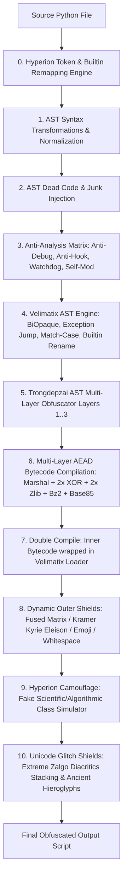

# AGENTS.md - Developer & Agent Operational Handbook

Welcome to the **Tr0ngX Ultimate AST Obfuscator** codebase repository. This document serves as the authoritative operational manual and architecture guide for all AI Agents (Antigravity, Codex, Crush, Claude, etc.) and human contributors collaborating on this project.

---

## 1. Core Directives & Mandatory Rules for Agents

All AI agents operating on this repository MUST strictly abide by the following protocol:

1. **Documentation Synchronization (Strict Mandate)**:
   - Every time a new feature, new transformation pass, or new `--` command-line argument is added or modified in `tr0ngx_obfuscator.py`, the agent **MUST immediately update** both `README.md` and `AGENTS.md` with:
     - The exact CLI argument syntax and choices.
     - A concise explanation of what the feature does and its position in the pipeline.
     - Updated CLI option tables and summary metrics.
2. **Emoji Policy in Documentation**:
   - Per repository design standards, markdown documentation (`README.md`, `AGENTS.md`, docs) MUST remain clean of emojis, with the sole exception of the footer:
     `Made with ❤️ by Tr0ngX & Anti-Reverse Engineering Research Community`
3. **Deterministic Compatibility & Zero-Crash Standard**:
   - Every obfuscation mode, loader, and cryptographic wrapper MUST execute flawlessly on **Python 3.10, 3.11, 3.12, 3.13, and 3.14** without syntax errors or runtime regressions.
   - Self-testing and assertion verification must pass with 100% success before handing over work.
4. **Git Discipline**:
   - Remove scratch or temporary test output files (e.g. `test_*.py` generated during testing) before committing.
   - Commit changes with clear, descriptive messages and push directly to `origin main`.

---

## 2. System Architecture Overview

Tr0ngX is an industrial-grade, multi-stage Python AST Obfuscator combining advanced compiler theory, control flow flattening, cryptographic authenticated loaders, dynamic outer shields, and decompiler crash mechanics.

### Pipeline Execution Order



---

## 3. Comprehensive CLI Flag Reference

| Flag | Category | Description | Choices / Format |
| :--- | :--- | :--- | :--- |
| `-i`, `--input` | IO | Target Python script(s) or glob patterns to obfuscate | `<filepath(s) / glob>` |
| `-D`, `--dir`, `--directory` | IO | Target directory containing Python files to batch obfuscate | `<dirpath>` |
| `-r`, `--recursive` | IO | Recursively scan all subdirectories when batch obfuscating | Flag |
| `-w`, `--workers`, `-j` | Resource | Number of parallel worker threads for concurrent batch obfuscation | e.g. `4`, `8` |
| `-o`, `--output` | IO | Custom output file destination (or output directory for batch) | `<filepath / dirpath>` |
| `-m`, `--mode` | Core AST | AST obfuscation complexity level | `1`, `2`, `3` |
| `--moreobf` | Core AST | Inject extra AST dead code and try-except decoy blocks | `y` / `n` |
| `--antidebug` | Protection | Inject anti-debugging watchdog daemon, Win32 PEB/remote debug checks, and hook blockers | `y` / `n` |
| `--antivm` | Protection | Inject Anti-VM & Automated Sandbox Detection matrix (CPU, screen metrics, drivers, registry) | `y` / `n` |
| `--anti-dump` | Protection | Inject in-memory anti-dump shield, GC object scrubber, and code metadata neutralizer | `y` / `n` |
| `--selfmod` | Protection | Inject runtime signature mutating self-modification layer | `y` / `n` |
| `--math-opaque` | Core AST | Inject number-theoretic mathematical opaque predicates (Quadratic Non-Residues mod 7, Euler invariants) | `y` / `n` |
| `--dyn-strings` | Core AST | Dynamic per-callsite string XOR encryption with AST-coordinate derived keys | `y` / `n` |
| `--compile` | Crypto | Multi-layer authenticated AEAD compilation (Marshal + XOR + Zlib + Bz2) | `y` / `n` |
| `--password` | Crypto | Password for Argon2id + ChaCha20Poly1305 / PBKDF2 authenticated payload encryption | `<string>` |
| `--password-file` | Crypto | Path to external file containing encryption password | `<filepath>` |
| `--max-output-size` | Resource | Maximum output file size DoS limit (aborts and removes if exceeded) | e.g. `10MB`, `50MB` |
| `--seed` | Core AST | Deterministic seed for reproducible builds | e.g. `1337` |
| `--velimatix` | Velimatix | Enable Velimatix ExceptionJump & AST control flow engine | `y` / `n` |
| `--veli-level` | Velimatix | Velimatix intensity level (1: BiOpaque, 2: Exception Jump, 3: Match-Case State Machine) | `1`, `2`, `3` |
| `--double-compile` | Crypto | Package inner compiled bytecode inside outer Velimatix loader | `y` / `n` |
| `--kramer` | Outer Shield | Wrap with Kramer Kyrie Eleison outer dynamic shield class | `y` / `n` |
| `--matrix`, `--fused` | Outer Shield | Enable 3-Track Symbiotic Interleaved Matrix Shield (Kyrie + Emoji + Whitespace) | `y` / `n` |
| `--emoji-obf` | Outer Shield | Encode output payload as executable Unicode Animal block identifier stream | `y` / `n` |
| `--whitespace-obf` | Outer Shield | Encode output as invisible whitespace bitfields (space/tab binary) | `y` / `n` |
| `--blank-padding`, `--blank-lines` | Outer Shield | Prepend 300+ blank screen lines padding to conceal code in text editors | `y` / `n` |
| `--cjk-vars` | Identifiers | Use CJK Chinese identifiers and PyCool ancient docstrings | `y` / `n` |
| `--homoglyph` | Identifiers | Use Cyrillic/Greek lookalike variable names (a→а, o→о, e→е) | `y` / `n` |
| `--rare-unicode` | Identifiers | Use Rare Unicode characters (CJK Ext-B, Kangxi Radicals, Hieroglyphs) | `y` / `n` |
| `--zalgo`, `-z` | Glitch Shield | Enable Extreme Zalgo Combining Marks Shield (Heavy Diacritics Stacking - `Z͑͗͑͗...`) | `y` / `n` |
| `--hyperion` | Hyperion | Enable Full Hyperion Engine (Builtins remapping, token variable remap, math/str splitting, chunk shells) | `y` / `n` |
| `--camouflage`, `--camo` | Camouflage | Wrap in Hyperion Fake Scientific Simulation Class (`MemoryAccess`, `StackOverflow`, `Theory`, etc.) | `y` / `n` |
| `--force-py` | Environment | Lock execution strictly to specified Python version (`off` to disable) | `3.10`, `3.11`, `3.12`, `3.14`, etc. |
| `--max-ram` | Resource | Limit maximum RAM consumption in megabytes | e.g. `2048` |
| `--cores` | Resource | Limit maximum CPU cores/threads utilized | e.g. `2`, `4` |
| `--debug-map` | Diagnostics | Export JSON mapping of renamed symbols and stage durations | `AUTO` or `<path>` |
| `--debug`, `-d` | Diagnostics | Verbose stage logging and tracebacks | Flag |
| `--profile` | Diagnostics | Display detailed Profiling Waterfall & Bottleneck table | Flag |
| `--log-file` | Diagnostics | Write diagnostic execution logs to external file | `<path>` |
| `--strict` | Diagnostics | Abort immediately on any stage warning or non-critical error | Flag |
| `--no-art`, `-q` | UI | Suppress ASCII art banners and styling for headless CLI/Agent environments | Flag |

---

## 4. Key Subsystem Details

### 4.1 Hyperion Engine (`--hyperion`)
- **AddBuiltins**: Scans token AST, extracts all builtins referenced in code, and prepends explicit imports (`from builtins import ...`) to enable dynamic namespace redirection.
- **CreateVars & Scope Remapper**: Generates randomized variables for runtime primitives (`globals`, `locals`, `vars`, `__import__`, `getattr`, `dir`, `exec`, `eval`, `compile`, `unhexlify`, `join`, `bool`, `str`, `float`).
- **Math & String Identifier Splitting**: Transforms numeric constants into arithmetic algebraic identities (`val = rnum - (rnum - val)` with underscore notation `1_2_3_4`) and encodes strings through arithmetic reverse step slicing (`[::-+-(-1)]`).
- **Chunk Shell Encapsulation**: Partitions top-level statements into isolated valid AST chunks, each encapsulated inside `eval(compile(..., mode='exec'))`.

### 4.2 Hyperion Camouflage Layer (`--camouflage`)
- Replaces the outer file structure with an authentic-looking algorithmic or scientific computing class (`MemoryAccess`, `StackOverflow`, `Theory`, `Calculate`, `Hypothesis`).
- Creates mock mathematical methods, `@property` simulated memory addresses (`<__main__.MemoryAccess object at 0x000007FF...>`), and fake `try...except` exception handlers.
- Slices the obfuscated binary payload into Base85 parameter chunks stored as class properties and seamlessly reconstructs the payload at runtime.

### 4.3 Extreme Zalgo Combining Marks Shield (`--zalgo`, `-z`)
- Employs valid Python PEP 3131 Unicode identifiers utilizing `XID_Continue` characters (`Mn`/`Mc` diacritics in `U+0300..U+036F`, `U+1AB0..U+1AFF`, `U+1DC0..U+1DFF`, `U+20D0..U+20FF`, `U+FE20..U+FE2F`).
- Stacks 25 to 60 combining diacritical marks onto each variable character (`Z͑͗͑͗...`), overwhelming the text rendering engines of GUI editors, decompiler GUIs, and disassemblers (DirectWrite, HarfBuzz, FreeType, Scintilla).
- Injects massive cascading glitch text docstrings at the payload boundaries.

### 4.4 Fused Symbiotic Matrix Shield (`--matrix`, `--fused`)
- Interweaves three distinct disguise tracks into a single unified stream:
  1. Kyrie Eleison Alphabet Rotation + Dynamic Caesar Offset.
  2. Masked Unicode Emoji Stream (`U+1F400` Animal & Symbol block).
  3. Invisible Space/Tab Bitfield Matrix.
- Uses a deterministic Linear Congruential Generator (LCG) PRNG state to interleave and reconstruct tracks in memory with zero file-size bloat.

---

## 5. Verification & Testing Protocol

Before committing any modifications:
```bash
# 1. Run full regression test matrix (Multi-threaded across CPU workers)
python tests/run_all_tests.py -w 6

# 2. Run complex challenge paradigm test
python tr0ngx_obfuscator.py -i complex_target.py -o test_full_matrix.py -m 3 --moreobf y --antidebug y --selfmod y --velimatix y --veli-level 3 --compile y --double-compile y --kramer y --hyperion y --camouflage y --zalgo y --matrix y --no-art

# 3. Verify execution of obfuscated target
python test_full_matrix.py

# 4. Clean up generated test artifacts
powershell -Command "Remove-Item -Force -ErrorAction SilentlyContinue test_full_matrix.py"
```

---

Made with ❤️ by Tr0ngX & Anti-Reverse Engineering Research Community
