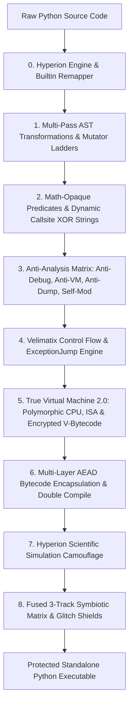

<div align="center">

# Tr0ngX Ultimate AST Obfuscator

**Next-Generation Multi-Layer Polymorphic AST Obfuscation & Dynamic Anti-Analysis Engine**  
*Engineered for Python 3.10, 3.11, 3.12, 3.13, and 3.14+*

[](https://github.com/Tr0ngX/Tr0ngX-Ultimate-AST-Obfuscator/actions)
[](https://www.python.org/)
[](LICENSE)
[](#key-architectures--features)

---

</div>

## Overview

**Tr0ngX Ultimate AST Obfuscator** is an enterprise-grade Python obfuscation framework designed to protect proprietary Python intellectual property against static analysis, decompilation (PyCDC, uncompyle6, decompyle3), dynamic debugging (PDB, PyDevd, Debugpy), audit-hook tampering (PEP 578 / PEP 669), and memory inspection.

Combining **deep Abstract Syntax Tree (AST) mutations**, **cryptographically authenticated multi-layer AEAD encapsulation**, **symbiotic multi-track shield loaders**, and **continuous runtime watchdog threads**, Tr0ngX delivers unbreakable protection while preserving 100% semantic runtime equivalence.

---

## Key Architectures & Features



### 1. Multi-Layer AST Transformations
- **Control Flow Flattening & Opaque Predicates**: Converts linear block sequences into state-machine dispatchers with algebraic and bitwise opaque predicates.
- **Arithmetic Mutator Ladders**: Replaces constants and operators with mathematical identity ladders, bit shifts, XOR chains, and trigonometric invariances.
- **Velimatix `ExceptionJump` Dispatcher**: Routes normal control execution flow across structured `try...except` exception handlers.
- **Method & Function Cloning**: Generates randomized decoy branches and polymorphic clones to mislead decompilers.
- **Builtin Dynamic Obfuscation & Renaming**: Intercepts and remaps standard builtin calls (`print`, `exec`, `eval`, `globals`, `__import__`) through runtime resolution.

### 2. True Virtual Machine Virtualization Engine 2.0 (TVM)
- **Virtual CPU & Custom ISA**: Translates Python AST into polymorphic custom bytecode instructions with zero-exec fallback (full execution of closures, nested functions, classes, async with/for, and exception unwind handlers).
- **Randomized Dispatch Table**: Opcode mappings are randomized per build via affine transformation hashes `(op * M + A) % 256` with dead traps (`TRAP` / `os._exit(1)`) on unassigned slots.
- **KDF V3 Domain-Separated Cryptography**: Code constants and nested bytecode objects are protected by independent `TRX_TVM_ENC_KEY_V3` and `TRX_TVM_MAC_KEY_V3` keys with SHA-256 HMAC integrity verification and level 9 zlib compression.
- **Anti-Dump Memory Scrubbing**: Aggressively clears frame stacks, exception handlers, and local dictionaries on frame exit with garbage collection purging.

### 3. Mathematical Opaque Predicates & Dynamic Callsite XOR Strings
- **Number-Theoretic Opaque Predicates (`--math-opaque`)**: Injects quadratic non-residues mod 7 and Euler totient invariants into dead/live conditional branches.
- **Dynamic Per-Callsite XOR Strings (`--dyn-strings`)**: Dynamically encrypts string literals per callsite using keys derived from AST topological coordinates.

### 4. Polymorphic Identifier Renaming & Glitch Shields
- **Collision-Free Variable Generation**: Deterministic, scope-aware renaming engine.
- **CJK Chinese & PyCool Docstrings**: Obfuscates symbols into multi-byte CJK ideographs and synthetic docstrings.
- **Homoglyph Disguise**: Uses Cyrillic and Greek unicode lookalikes (`а` vs `a`, `о` vs `o`) to render source code unreadable.
- **Rare Ancient Unicode Scripts**: Leverages Egyptian Hieroglyphs, Cuneiform, Yi Syllables, Tangut, and CJK Extension-B codepoints.
- **Extreme Zalgo Diacritics Shield (`--zalgo`)**: Stacks combining characters (`Z͑͗͑͗...`) to overwhelm text rendering engines and disassemblers.

### 5. Dynamic Cryptography & Environment-Bound Key Derivation
- **Cryptographic Randomness**: Employs Python `secrets` CSPRNG for all keys, salts, and nonces.
- **Multi-Layer AEAD Encryption**: Combines zlib/bz2 compression with authenticated stream encryption and HMAC-SHA256 message authentication codes.
- **Runtime Environment Key Derivation (`_derive_runtime_keys`)**: Keys are derived dynamically at runtime from cryptographic salt and interpreter environment (`sys.version`, `platform`, `sys.maxsize`, `sys.byteorder`).

### 6. Symbiotic Multi-Track Outer Shields & Camouflage
- **Hyperion Camouflage (`--camouflage`)**: Encapsulates binary payloads inside authentic-looking algorithmic and scientific simulation classes (`MemoryAccess`, `StackOverflow`, `Hypothesis`).
- **Kramer Outer Shield (Kyrie Eleison)**: Encapsulates payloads into dynamic polymorphic classes with fake type annotations, memory anti-dumping, and file-read self-verification.
- **Emoji Stream Obfuscation**: Transforms bytecode stream into executable sequences of Unicode animal emojis (`🐀🐁🐂`).
- **Whitespace Invisible Bitfields**: Hides payloads within invisible Unicode tab/space bitfields.
- **Fused 3-Track Symbiotic Matrix Shield (`--matrix`)**: Interweaves Kramer Kyrie, Emoji Stream, and Whitespace Bitfields into a single zero-bloat in-memory stream.

### 7. Enterprise Anti-Tamper & Anti-Analysis Matrix
- **Anti-Debug Watchdog Daemon**: Continuous background patrol verifying builtin integrity, PEB debugger flags, and anti-monkey-patching.
- **Anti-VM & Sandbox Detection (`--antivm`)**: Deep hardware and hypervisor probing checking MAC OUIs, SCSI virtual disks, system uptime, and VM driver devices.
- **In-Memory Anti-Dump & GC Object Scrubber (`--anti-dump`)**: Neutralizes reflection inspection, purges `linecache`, and zeros bytearrays post-execution.
- **Self-Modifying Signature Morphing (`--selfmod`)**: Dynamically recalculates source hashes and injects zero-width Unicode signatures to invalidate static forensic dumps.
- **Tracer & Profiler Nullification**: Intercepts `sys.settrace()`, `sys.setprofile()`, and locks `sys.monitoring` tool IDs on Python 3.12+.
- **Meta-Path Import Interceptor (PEP 451)**: `_ImportBlocker` blocks decompiler and debugger modules (`uncompyle6`, `pycdc`, `debugpy`, `pydevd`, `xdis`, `coverage`).

### 8. Resource Management & Diagnostic Profiling
- **RAM & CPU Core Limits**: Built-in `--max-ram` (MB) and `--cores` limiter prevents memory exhaustion during heavy obfuscation passes.
- **Micro-Stage Profiler & Debug Map**: High-resolution performance timer tracking and optional JSON mapping export (`--debug-map`).

---

## Installation & Requirements

### System Requirements
- **Python Version**: Python 3.10, 3.11, 3.12, 3.13, or 3.14+ (64-bit recommended).
- **Operating System**: Windows, Linux, macOS.

### Dependencies
```bash
git clone https://github.com/Tr0ngX/Tr0ngX-Ultimate-AST-Obfuscator.git
cd Tr0ngX-Ultimate-AST-Obfuscator

# Install dependencies (optional, for enhanced TUI and CPU/RAM management)
pip install -r requirements.txt
```

---

## Usage Guide

### 1. Interactive Terminal UI (TUI) Mode
Run the obfuscator without arguments to launch the step-by-step interactive configuration prompt:
```bash
python tr0ngx_obfuscator.py
```

### 2. Command Line Interface (CLI) Mode
Execute automated obfuscation directly via CLI arguments:

```bash
# Basic Mode 1 (Fast AST + String obfuscation)
python tr0ngx_obfuscator.py -i input.py -o output.py -m 1

# Standard Mode 2 with Compilation & Kramer Outer Shield
python tr0ngx_obfuscator.py -i input.py -o output.py -m 2 --compile y --kramer y

# Mode 3 + Velimatix Engine + Double Compilation
python tr0ngx_obfuscator.py -i input.py -o output.py -m 3 --compile y --velimatix y --veli-level 3 --double-compile y

# Multi-File Batch Obfuscation (Multiple target scripts)
python tr0ngx_obfuscator.py -i file1.py file2.py file3.py -o dist/ -m 2 --compile y -w 4

# Entire Directory Recursive Obfuscation
python tr0ngx_obfuscator.py -D src/ -o dist/ -r -m 2 --compile y --matrix y

# MAXIMUM POWER MODE (TVM 2.0, Camouflage, Fused Matrix, Anti-Analysis Matrix & Unicode Shields)
python tr0ngx_obfuscator.py -i input.py -o output.py -m 3 \
  --moreobf y \
  --antidebug y \
  --antivm y \
  --anti-dump y \
  --selfmod y \
  --math-opaque y \
  --dyn-strings y \
  --vm-obf y \
  --vm-level 3 \
  --compile y \
  --velimatix y \
  --veli-level 3 \
  --double-compile y \
  --camouflage y \
  --matrix y \
  --kramer y \
  --emoji-obf y \
  --whitespace-obf y \
  --cjk-vars y \
  --rare-unicode y \
  --homoglyph y \
  --zalgo y \
  --max-ram 2048 \
  --cores 4
```

### CLI Options Reference

| Flag | Description | Options |
| :--- | :--- | :--- |
| `-i`, `--input` | Path to target Python file(s) or glob patterns to obfuscate | `<filepath(s) / glob>` |
| `-D`, `--dir`, `--directory` | Target directory containing Python files to batch obfuscate | `<dirpath>` |
| `-r`, `--recursive` | Recursively scan all subdirectories when batch obfuscating | Flag |
| `-w`, `--workers`, `-j` | Number of parallel worker threads for concurrent batch obfuscation | e.g. `4`, `8` |
| `-o`, `--output` | Custom destination output path (or destination folder for batch) | `<filepath / dirpath>` |
| `-m`, `--mode` | Obfuscation complexity level | `1`, `2`, `3` |
| `--moreobf` | Extra string & integer mutation pass | `y` / `n` |
| `--antidebug` | Inject multi-vector Anti-Debug watchdog shield | `y` / `n` |
| `--antivm` | Inject Anti-VM, Automated Sandbox & Virtual Network Adapter Detection matrix (MAC OUI, virtual NICs, SCSI disks, drivers, registry) | `y` / `n` |
| `--anti-dump` | Inject in-memory anti-dump shield, GC object scrubber, and code metadata neutralizer | `y` / `n` |
| `--selfmod` | Inject self-modifying code & anti-tamper layer | `y` / `n` |
| `--math-opaque` | Inject number-theoretic mathematical opaque predicates (Quadratic Non-Residues mod 7, Euler invariants) | `y` / `n` |
| `--dyn-strings` | Dynamic per-callsite string XOR encryption with AST-coordinate derived keys | `y` / `n` |
| `--compile` | Authenticated AEAD bytecode compilation | `y` / `n` |
| `--password` | Password for Argon2id + ChaCha20Poly1305 / PBKDF2 authenticated payload encryption | `<string>` |
| `--password-file` | File path containing encryption password (avoids process table snooping) | `<filepath>` |
| `--max-output-size` | Maximum output size DoS limit (aborts and unlinks if exceeded) | e.g. `10MB`, `50MB` |
| `--seed` | Integer seed for deterministic reproducible obfuscation builds | e.g. `1337` |
| `--double-compile` | Double compile (Tr0ngX + Velimatix loader) | `y` / `n` |
| `--vm-obf` | Enable VM Virtualization Engine (Polymorphic Virtual CPU + Encrypted Bytecode) | `y` / `n` |
| `--vm-level` | VM Virtualization intensity level (1: Basic, 2: + Traps/NOP, 3: + Dummy/Scrub) | `1`, `2`, `3` |
| `--velimatix` | Enable Velimatix ExceptionJump & AST spam engine | `y` / `n` |
| `--veli-level` | Velimatix intensity level | `1`, `2`, `3` |
| `--kramer` | Wrap with Kramer Kyrie Eleison outer dynamic shield | `y` / `n` |
| `--matrix`, `--fused` | Enable Fused 3-Track Symbiotic Matrix Shield | `y` / `n` |
| `--emoji-obf` | Encode output payload as executable Unicode identifier stream | `y` / `n` |
| `--whitespace-obf` | Encode output as invisible whitespace bitfields | `y` / `n` |
| `--blank-padding`, `--blank-lines` | Prepend 300+ blank screen lines padding to conceal code in editors | `y` / `n` |
| `--cjk-vars` | Use CJK Chinese identifiers & PyCool docstrings | `y` / `n` |
| `--homoglyph` | Use Cyrillic/Greek homoglyph variable names | `y` / `n` |
| `--rare-unicode` | Use Rare Unicode characters (CJK Ext-B, Kangxi, Hieroglyphs) | `y` / `n` |
| `--zalgo`, `-z` | Enable Extreme Zalgo Combining Marks Shield (Heavy Diacritics Stacking - Z͑͗͑͗...) | `y` / `n` |
| `--hyperion` | Enable Full Hyperion Engine (Builtins remapping + token variable remapping + math/str obfuscation + chunk shell) | `y` / `n` |
| `--camouflage`, `--camo` | Enable Hyperion Camouflage Layer (Fake Scientific/Algorithmic Class simulation) | `y` / `n` |
| `--force-py` | Multi-vector anti-spoof Python runtime & opcode architecture lock (`off` to disable) | `3.10`, `3.11`, `3.12`, `3.14`, etc. |
| `--max-ram` | Capping maximum RAM consumption (in MB) | e.g. `2048` |
| `--cores` | Capping maximum CPU cores used | e.g. `2`, `4` |
| `--debug-map` | Export detailed JSON rename mapping & stage metrics | `AUTO` or `<path>` |
| `--no-art` | Disable ASCII banner (quiet CLI mode) | Flag |
| `--strict` | Abort immediately on any stage warnings | Flag |

---

## Testing & Quality Assurance

Tr0ngX includes comprehensive native test suites and end-to-end multi-configuration stress harnesses:

```bash
# Run comprehensive mode-by-mode benchmark & performance profiler (Single-Threaded)
python benchmark_all_modes.py

# Run individual functional validation suites
python tests/test_01_core_features.py
python tests/test_02_crypto_math.py
python tests/test_03_data_structures.py
python tests/test_04_dynamic_reflection.py
python tests/test_05_edge_cases.py
python tests/test_06_crypto_password.py
python tests/test_07_reproducible.py
python tests/test_08_dos_limits.py
python tests/test_09_antivm_antidebug.py
python tests/test_10_complex_realworld.py
```

---

## Disclaimer

This software is developed and distributed for **legitimate software development, educational research, and proprietary code protection purposes only**. The authors assume no liability and are not responsible for any misuse or damage caused by this program.

---

## License

Distributed under the **MIT License**. See [`LICENSE`](LICENSE) for more information.

<div align="center">
<b>Made with ❤️ by Tr0ngX & Anti-Reverse Engineering Research Community</b>
</div>
